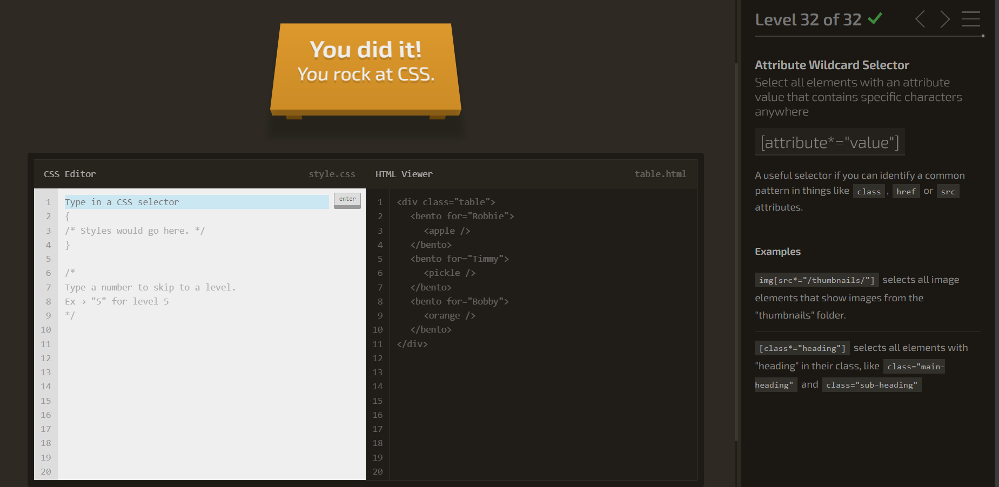
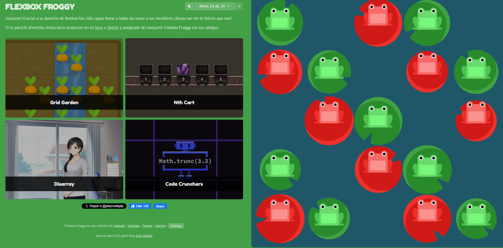
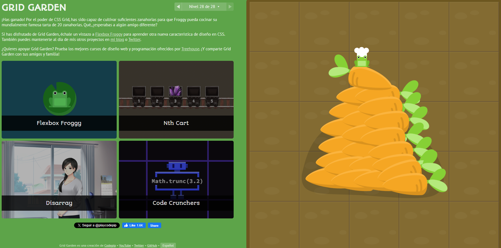

## Parte 1: Css Diner

 

## Parte 2: Juego FlexBox rana

 

## Parte 3: Juego Grid zanahorias

 

## Parte 4: Link pagina web

[link de la pagina](https://dsaw-2024-1.github.io/intro-to-github-pages-ValeRuizTo/) 

## Parte 5: Autoevaluacion : 4.7
